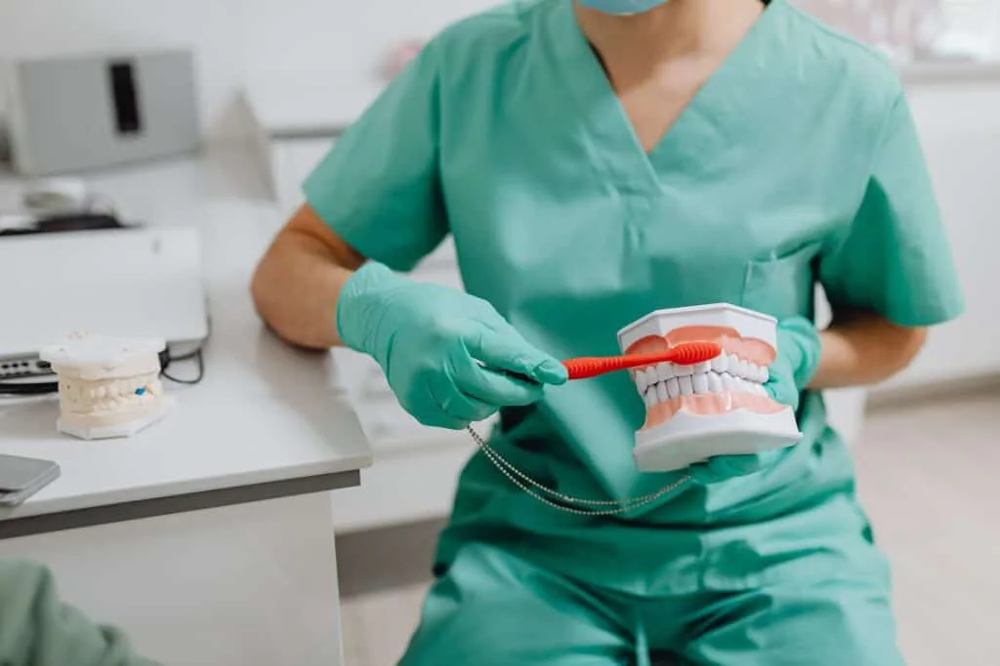
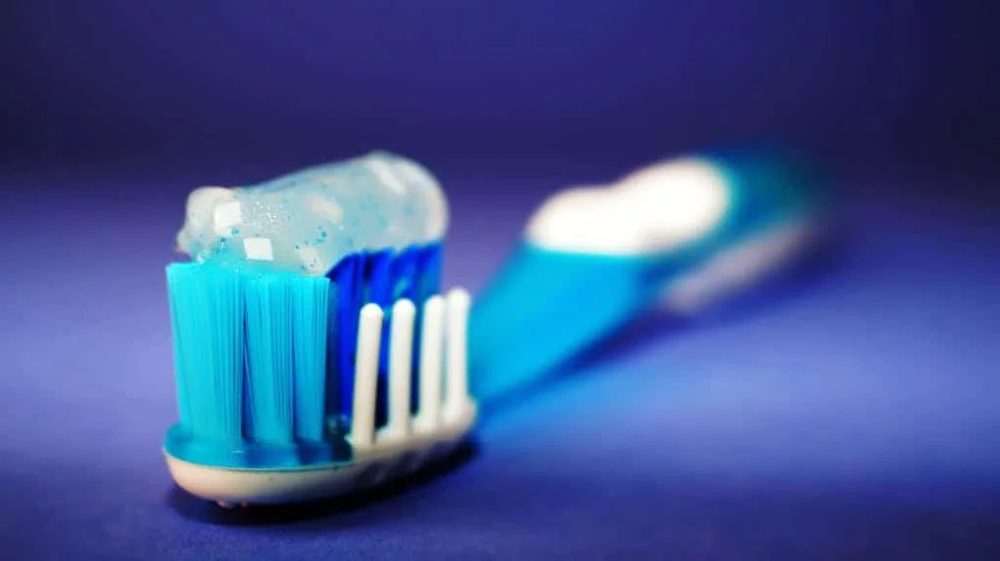
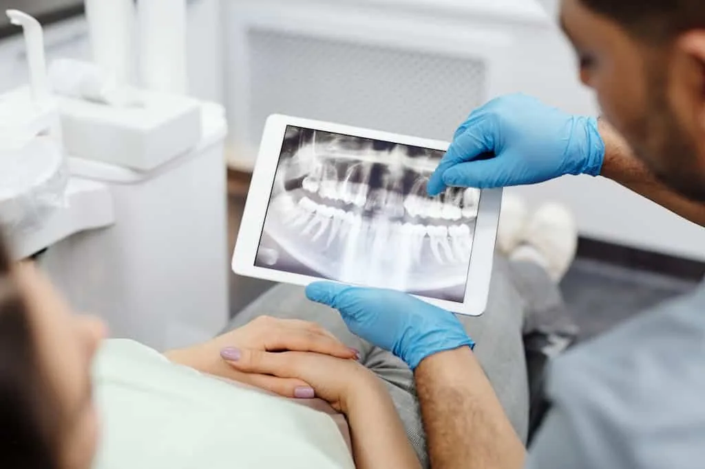
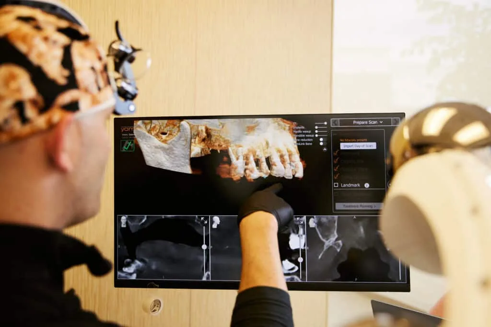

## Introduction:

Dental care can be confusing, with many myths and misconceptions floating around. These myths can lead to bad habits and poor dental health. At Vivid Smiles Dentistry, understanding the truth is the first step to maintaining a healthy smile. Knowing the facts can help you care for your teeth and gums better.

This article will debunk these myths and provide the correct information. We'll explain why these myths are false and give tips on proper dental care. By the end of this read, you'll better understand how to take care of your smile.

## Myth: Brushing Harder Cleans Better

### Why Brushing Harder Can Damage Your Teeth & Gums

Many people believe that brushing harder will make their teeth cleaner. However, brushing too hard can harm your teeth and gums. When you brush with too much force, you can wear down the enamel, the protective outer layer of your teeth. This can make your teeth more sensitive and prone to cavities.

Brushing too hard can also hurt your gums, causing them to recede. Receding gums expose the roots of your teeth, making them more susceptible to decay and leading to gum disease. Instead of brushing harder, it's more important to brush smarter.

### Proper Brushing Techniques For Effective Cleaning

Use a soft-bristled toothbrush for effective cleaning without causing damage. Hold your toothbrush at a 45-degree angle to your gums and use gentle, circular motions. Make sure to brush all surfaces of your teeth: the fronts, the backs, and the chewing surfaces. Brush for at least two minutes twice a day.

Remember also to clean your tongue, as it can harbor bacteria that cause bad breath. Replace your toothbrush or toothbrush head every three to four months or when the bristles become frayed. Proper brushing techniques will keep your teeth and gums healthy without causing unnecessary damage.

## Myth: You Only Need To Visit The Dentist When You Have A Problem

### Importance Of Regular Dental Check-Ups & Cleanings

Some people think they only need to see the dentist when they have a toothache or another obvious problem. This is a myth that can lead to serious dental issues. Regular dental check-ups and cleanings are crucial for maintaining oral health. During these visits, your dentist can spot problems before they become more serious and harder to treat.

Cleanings remove plaque and tartar that you can't eliminate with regular brushing and flossing. This helps prevent cavities and gum disease. Regularly seeing your dentist allows you to discuss your concerns and get advice on maintaining good oral hygiene.

### Preventative Care & Early Detection

Preventative care is key to keeping your teeth and gums healthy. Regular visits to the dentist allow for early detection of problems like cavities, gum disease, and even oral cancer. Early detection means that treatments are usually simpler and less expensive. For example, a minor cavity can be easily filled, but if left untreated, it can require a root canal or even extraction.

Your dentist can also provide preventative treatments, such as fluoride applications and dental sealants, to protect your teeth. You can avoid many common dental problems and enjoy a healthier smile by keeping up with regular check-ups and cleanings.

## Myth: Sugar Is The Only Cause Of Cavities

### Other Factors That Contribute To Cavities

While sugar is a well-known culprit, it isn't the only factor contributing to cavities. Carbohydrates in foods like bread, pasta, and some fruits can also break down into sugars in your mouth, feeding the bacteria that cause cavities. Poor oral hygiene is another major factor. If you don't brush and floss regularly, plaque can build up on your teeth, leading to decay.

Saliva production also plays a role. Saliva helps wash away food particles and neutralize acids in your mouth. Conditions like dry mouth can make you more prone to cavities. Finally, your overall health and medications can impact oral health, contributing to the likelihood of developing cavities.

### How Diet & Oral Hygiene Play A Role

Maintaining a balanced diet rich in vitamins and minerals can help keep your teeth strong and healthy. Foods high in calcium, such as dairy products and phosphorus in meats and beans, help strengthen tooth enamel. Crunchy fruits and vegetables can also help clean your teeth as you eat.

Good oral hygiene habits are crucial. Brush your teeth twice daily with fluoride toothpaste and floss daily to remove plaque between your teeth. Drinking plenty of water can also help wash away food particles and keep your mouth hydrated. Regular dental visits are essential for professional cleanings and check-ups to catch any issues early.

## Myth: Teeth Whitening Damages Enamel

### Understanding How Teeth Whitening Works

Teeth whitening is a popular cosmetic procedure many people fear will damage their enamel. However, when done correctly, teeth whitening is safe and effective. The process involves using bleaching agents, such as hydrogen peroxide or carbamide peroxide, to break down stains on the surface of your teeth.

Whitening products are designed to penetrate the enamel and break up stains without harming the tooth structure. Professional teeth whitening done by a dentist is exceptionally safe, as your dentist will ensure the appropriate concentration of bleaching agents is used and take precautions to protect your gums.

### Safe Teeth Whitening Practices & Options

For the safest results, consider seeking professional teeth whitening from a dentist. They can provide you with custom-fitted trays and a controlled bleaching solution. This minimizes the risk of gum irritation and ensures even whitening.

If you whiten your teeth at home, use products with the American Dental Association (ADA) Seal of Acceptance. Follow the instructions carefully and avoid overuse. Natural methods like brushing with baking soda or using activated charcoal can also help, but these should be used sparingly to avoid abrasion.

## Conclusion

Understanding the truth about common dental myths is essential for maintaining optimal oral health. Brushing harder won't clean your teeth better, and skipping regular dental visits can lead to bigger problems. Cavities aren't caused by sugar alone; your diet and oral hygiene play significant roles. Lastly, teeth whitening, when done correctly, doesn't harm your enamel.

At Vivid Smiles Dentistry, we strive to educate our patients and provide the best dental care possible. Remember, proper dental care can be simple and effective. If you have any questions or need dental services, our team is here to help.

Take the next step towards a healthier smile by scheduling your appointment with Vivid Smiles Dentistry today! Your journey to excellent dental health starts with us.
