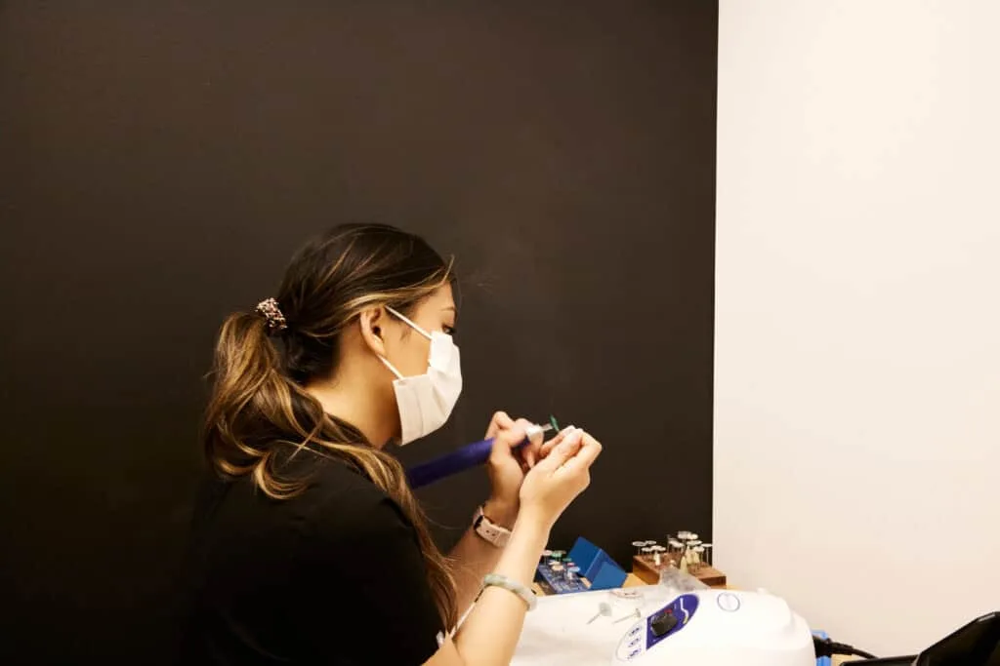

[Dental implants](https://www.ncbi.nlm.nih.gov/books/NBK470448/#:~:text=Introduction,Dahl%20in%20Sweden.) are widely considered one of the [most reliable ways to replace missing teeth,](https://pmc.ncbi.nlm.nih.gov/articles/PMC10055991/#:~:text=Implant%20therapy%20is,as%20natural%20teeth.) but it’s not often talked about how much dental implants hurt. The answer is that most patients report far less discomfort than expected, thanks to modern techniques and local anesthesia. However, it’s important to understand the whole experience from consultation to recovery to

### Comfort During the Procedure

The implant placement is usually performed under local anesthesia, which numbs the surrounding area so you don’t feel pain during the procedure. Many patients describe the experience as similar to having a filling or tooth extracted. Some clinics also offer sedation options if anxiety is a concern, helping you stay relaxed throughout the procedure.

The jawbone where the implant is placed has less nerve sensitivity than your gums or teeth, so there is minimal discomfort during the drilling. Most work is done with precision tools and guided planning to minimize tissue trauma.

### What to Expect After the Surgery

It’s common to feel mild discomfort or pressure once the anesthesia wears off. Over the next few days, you may experience swelling, slight bruising, or tenderness near the surgical site. This is part of your body’s natural healing response, not a sign that something’s gone wrong. Most patients manage these symptoms easily with over-the-counter medications.

In the first 24-72 hours after the procedure, Dr. Bryce Richardson recommends avoiding soft foods and hot beverages. Any soreness usually starts to subside after the third day, and most patients return to normal activities within a week.

### How Long Does the Pain Last?

Most discomfort is temporary and should decrease each day. If pain intensifies instead of improving, or swelling and bleeding continue beyond a few days, [contact our team at Vivid Smiles Dentistry](https://vividsmilesdentistry.com/contact/). These symptoms could indicate an infection or healing complication, but these issues are rare when aftercare instructions are followed.

The titanium implant itself does not cause ongoing pain once healed. It [integrates with your bone over time through a process called osseointegration](https://pmc.ncbi.nlm.nih.gov/articles/PMC3602536/#:~:text=The%20processes%20of%20osseointegration%20involve%20an%20initial%20interlocking%20between%20alveolar%20bone%20and%20the%20implant%20body%2C%20and%20later%2C%20biological%20fixation%20through%20continuous%20bone%20apposition%20and%20remodeling%20toward%20the%20implant.) and becomes a stable, permanent part of your bite.

### Managing Anxiety Around Pain

For many people, the fear of pain is greater than the reality of the procedure. At Vivid Smiles Dentistry, Dr. Bryce Richardson takes time to walk patients through each step, offers tailored sedation options, and creates a calming experience from start to finish.

Discussing those concerns with your dentist early can help if you’re anxious about how you feel. [Understanding the process and what to expect often makes it easier to move forward confidently.](https://pmc.ncbi.nlm.nih.gov/articles/PMC10485550/#:~:text=Pain%20associated%20with,dental%20implant%20insertion.)

### When to Call Your Dentist

While most people recover without complications, contact our team if you experience:

- Persistent pain or swelling after one week
- Pain that interferes with sleep or eating
- Signs of infection, such as fever, pus, or foul taste near the implant

Early support from our team can help prevent further issues and keep your recovery on track.

### Ready to Explore Dental Implants?

If you’ve been putting off treatment because you’re worried about pain, it might be time to talk with a dentist who prioritizes both comfort and long-term care. At [Vivid Smiles Dentistry](https://vividsmilesdentistry.com/), we are here to guide you through every step, answer any questions, and provide personalized care from consultation to recovery.
