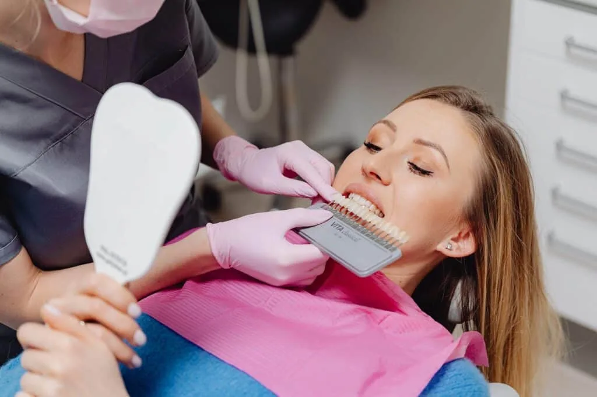
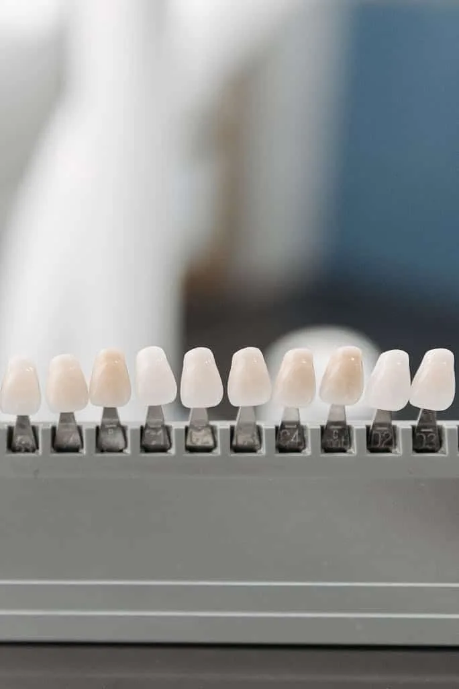
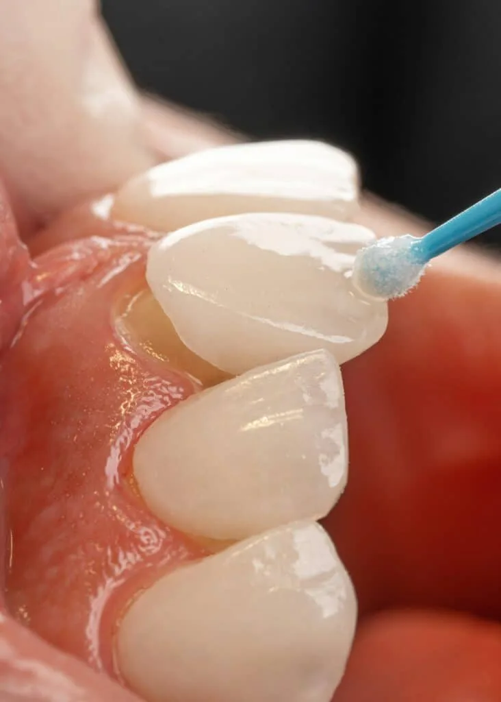
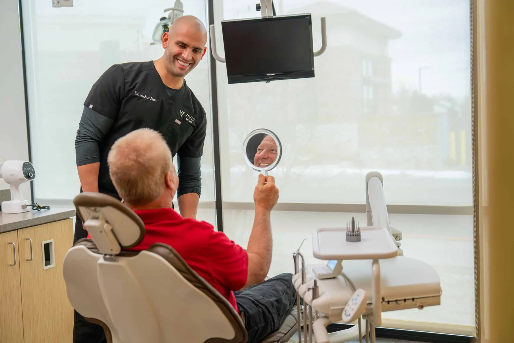
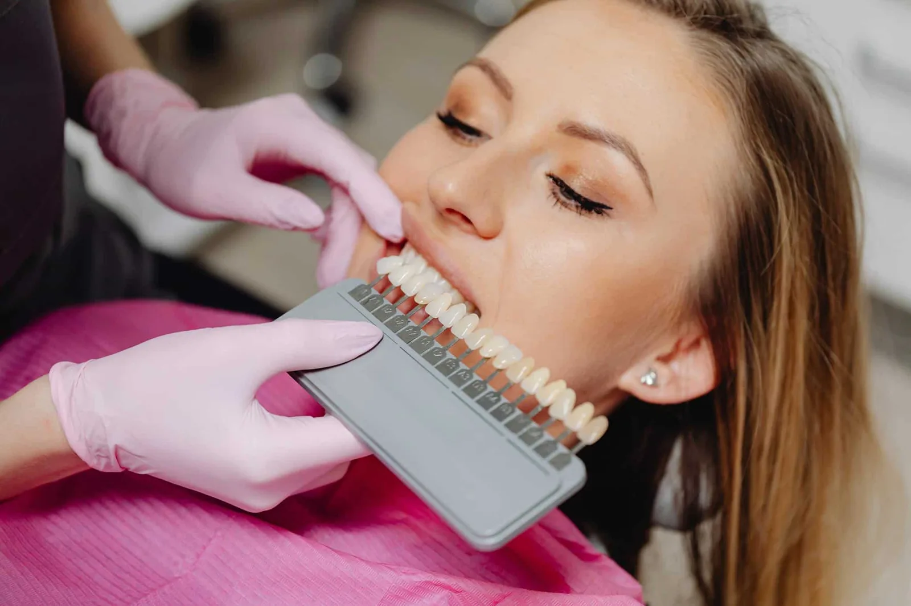
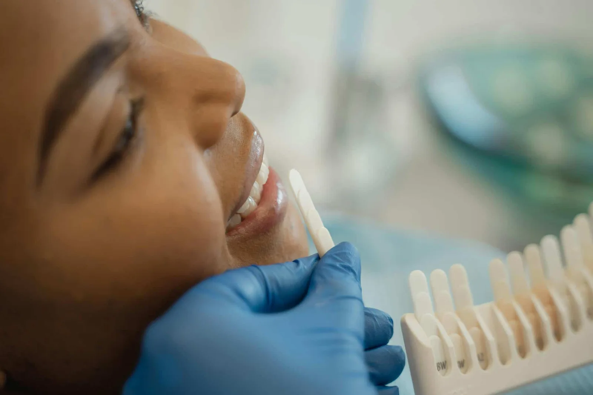

## Introduction:

Feeling good about your smile can have a big impact on your confidence. Whether you’re attending a social event or a job interview, a bright, healthy smile can make all the difference. Cosmetic dentistry offers various ways to improve your smile, making you feel more confident and happy with your appearance.

At Vivid Smiles, we understand the importance of having a smile you love. Our team is dedicated to providing comfortable and effective cosmetic dentistry options. This article will explore how different cosmetic dental procedures can boost your confidence and improve your overall well-being.

## Understanding Cosmetic Dentistry

### Definition & Purpose Of Cosmetic Dentistry

Cosmetic dentistry focuses on improving the appearance of your teeth, gums, and overall smile. While general dentistry addresses the health and function of your teeth, cosmetic dentistry aims to make them look better. This kind of dental work can involve anything from minor adjustments to major surgeries designed to enhance your smile.

The purpose of cosmetic dentistry goes beyond just aesthetics. A beautiful smile can boost your self-esteem, making you feel more confident in social and professional settings. Although you may seek cosmetic dentistry to fix issues like stained or crooked teeth, the benefits can be far-reaching, affecting your quality of life and personal relationships.

### Common Procedures & Techniques

Several procedures fall under the umbrella of cosmetic dentistry, each tailored to address specific issues. Teeth whitening is one of the most popular treatments, removing stains and brightening your smile. Veneers, thin shells placed over the front teeth, can conceal imperfections like chips, cracks, or severe discoloration.

Other common techniques include bonding, where a tooth-colored resin is applied to teeth to repair damage or improve appearance. Dental crowns cover damaged or decayed teeth, and bridges, which fill gaps left by missing teeth, are also frequently used. Orthodontic treatments like Invisalign can straighten teeth and correct bite issues without traditional metal braces.

## Benefits Of Cosmetic Dentistry

### Improved Appearance & Self-Esteem

One of cosmetic dentistry’s most notable benefits is appearance improvement. Procedures like teeth whitening, veneers, and Invisalign can transform a dull smile into a dazzling one. When you love how your smile looks, you are more likely to show it off. This can lead to increased self-esteem, which impacts various aspects of your life.

Smiling more often can make you appear friendlier and more approachable. This can enhance your social interactions and boost your confidence in public settings. People who feel good about their smiles are more likely to engage in conversations, attend social gatherings, and even take more photos. This newfound confidence can significantly improve your overall happiness and quality of life.

### Long-Term Dental Health Benefits

Cosmetic dentistry offers benefits that go beyond just a beautiful smile. Many procedures also contribute to better long-term dental health. For example, straightening crooked teeth with Invisalign can make them easier to clean, reducing the risk of cavities and gum disease. Similarly, repairing damaged teeth with crowns or veneers can prevent further decay or wear.

By addressing issues like misaligned teeth, gaps, and damaged enamel, cosmetic dentistry can improve how your mouth functions. This can improve chewing and speaking abilities, reduce discomfort, and enhance oral health. Investing in cosmetic dentistry is not just about beauty; it’s also about maintaining a healthy, functional mouth for years to come.

## Popular Cosmetic Dentistry Options

### Teeth Whitening & Veneers

Teeth whitening is one of the simplest and most effective ways to enhance your smile. This procedure removes stains and discoloration, making your teeth look brighter and more attractive. It’s quick and painless and can often be done in just one visit. At-home whitening kits are also available that can produce impressive results over a few weeks.

Veneers are another popular option for improving the appearance of teeth. They are thin shells made from porcelain or composite resin bonded to the front of teeth. They can cover imperfections such as chips, gaps, or severe discoloration. Veneers are custom-made to match the color and shape of your natural teeth, providing a seamless and beautiful result.

### InvisalignⓇ & Dental Implants

Invisalign offers a clear alternative to traditional metal braces for those looking to straighten their teeth. Invisalign aligners are virtually invisible and can be removed for eating and cleaning. Over time, they gently move your teeth into their desired position, providing a straight and beautiful smile without the hassle of metal braces.

Dental implants are a permanent solution for missing teeth. They are titanium posts surgically placed into the jawbone, acting as a sturdy foundation for replacement teeth. Implants look and function like natural teeth, allowing you to eat, speak, and smile confidently. Dental implants can also prevent bone loss in the jaw, preserving the shape of your face.

## Choosing The Right Cosmetic Dentist

### Factors To Consider

Selecting the right cosmetic dentist is crucial for achieving the results you desire. When choosing a cosmetic dentist, consider their experience and qualifications. Look for a dentist with specialized cosmetic procedure training and stay updated with the latest techniques and technologies.

Check out before-and-after photos of previous patients to understand the dentist’s work. Reading patient reviews can also provide insights into the dentist’s skill and patient care. Additionally, consider the range of services offered. A cosmetic dentist who offers a variety of treatments can provide more comprehensive care that meets your unique needs.

### Questions To Ask During Your Consultation

During your consultation, asking the right questions can help you make an informed decision. Some critical questions to consider include:

- What are my treatment options for achieving my desired results?
- How many times have you performed this procedure?
- What are the potential risks and benefits of this treatment?
- How long will the treatment take, and what should I expect during recovery?
- How much will the treatment cost, and what payment options are available?

Getting clear answers to these questions can help you feel more comfortable and confident in your decision-making process. It ensures that you understand the procedure, what it involves, and the expected outcome.

## Conclusion

Cosmetic dentistry is a powerful way to enhance your smile and confidence. Plenty of options suit your needs, from teeth whitening and veneers to Invisalign and dental implants. These procedures improve the look of your teeth and offer long-term health benefits that can enhance your quality of life.

Choosing the right cosmetic dentist is an essential step in this journey. Take the time to research and ask the right questions during your consultation. A skilled and experienced cosmetic dentist can help you achieve the smile you’ve always dreamed of.

Are you ready to transform your smile and boost your confidence? Schedule a consultation with Vivid Smiles today and discover the best cosmetic dentistry services. Our team is dedicated to providing top-notch care and helping you achieve a beautiful, confident smile.
