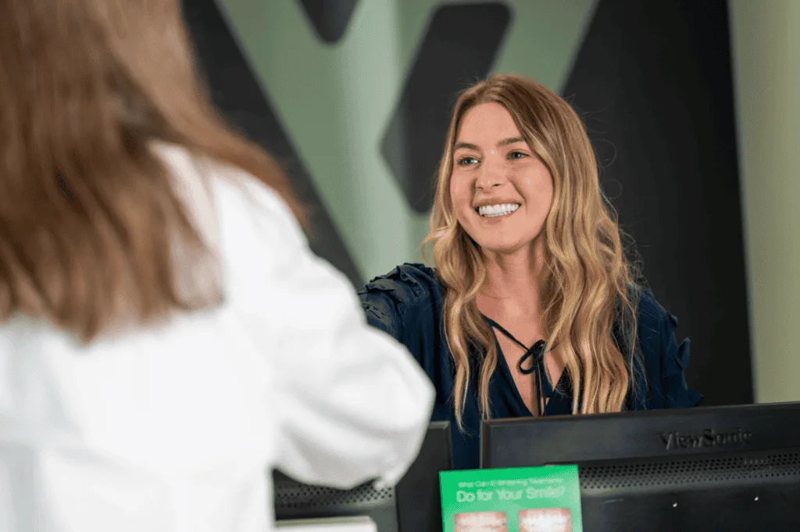
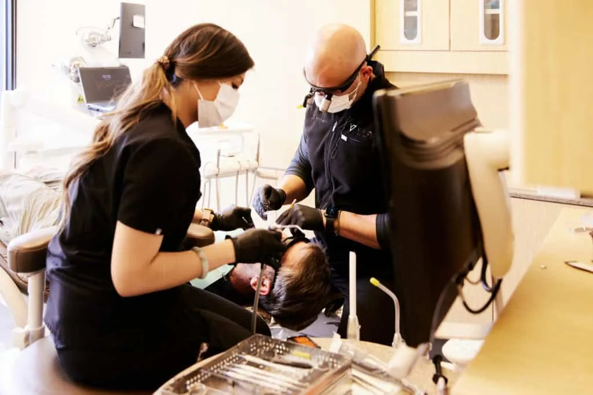
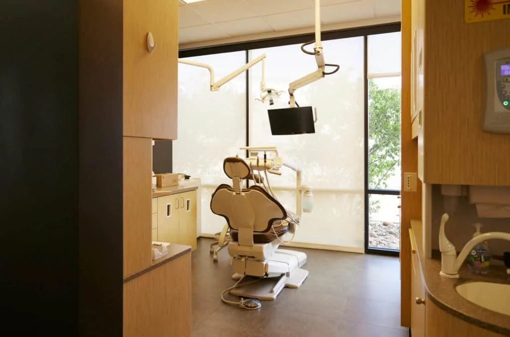
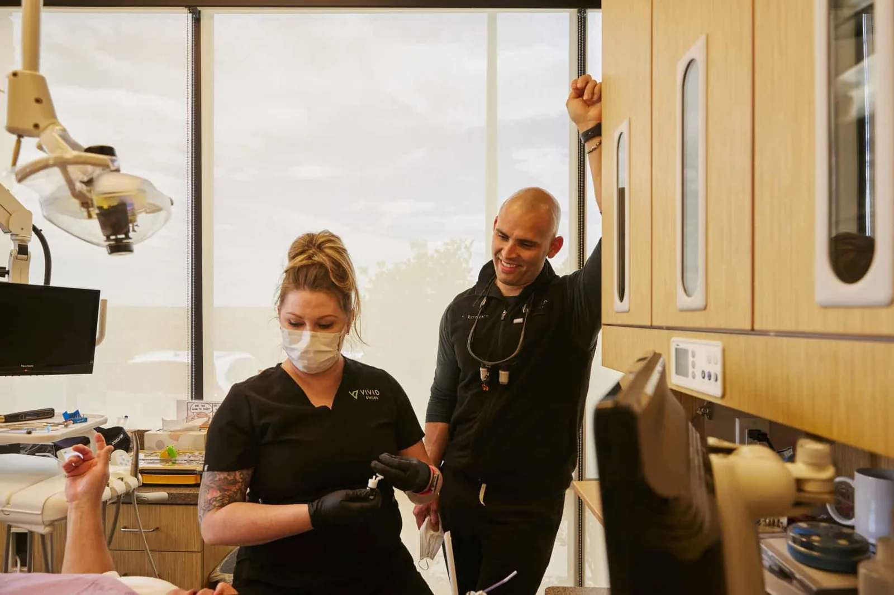
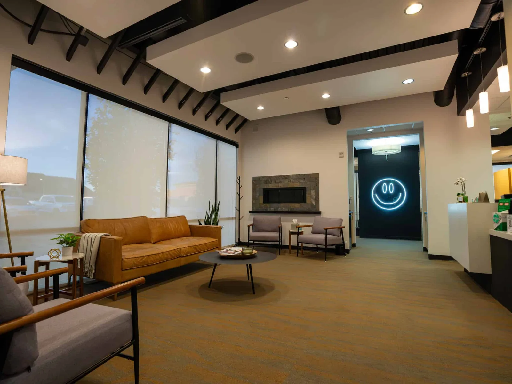

## Introduction:

A dental check-up is more than just a routine visit—it’s an essential step in maintaining your oral health and overall well-being. At Vivid Smiles, we understand that visiting the dentist can sometimes feel daunting, which is why we’ve worked hard to create an experience that’s comfortable, friendly, and state-of-the-art.

From the moment you walk through our doors, you’ll be greeted by our warm and attentive staff, who are dedicated to making your visit as pleasant as possible. And with the latest advancements in dental technology, we ensure your check-up is not only thorough but also as efficient and comfortable as it can be.

In this article, we’ll walk you through what you can expect during your dental check-up and how our team goes above and beyond to take care of your smile.

### What Happens During a Dental Check-Up

### A Warm Welcome

The first thing you’ll notice when you arrive at Vivid Smiles is the friendly atmosphere. Our front desk team will greet you with a smile and make sure you’re checked in quickly and comfortably. We know how valuable your time is, so we work hard to keep things running smoothly and on schedule.

If it’s your first visit, you’ll complete a brief health history form to help us understand your unique needs. Once everything is ready, one of our dental assistants will guide you to the treatment room and ensure you feel at ease.

### Beyond the Giveaway: Confident Smiles For All

Even if you’re not selected as our giveaway winner, we believe everyone deserves access to quality dental care. At Vivid Smiles Dentistry, we offer:

- Comprehensive consultations to assess your implant candidacy
- Advanced 3D imaging and treatment planning
- Payment plans that work with your budget
- The latest advancements in dental technology

### High-Tech X-Rays and Oral Examination

We use cutting-edge technology to provide you with the most accurate and comfortable care possible. During your check-up, we may take digital X-rays to get a closer look at your teeth and gums. Our advanced X-ray machines are designed to minimize radiation exposure and deliver crystal-clear images in seconds.

Dr. Richardson will then perform a detailed oral examination to check for cavities, gum health, and any other potential concerns. He’ll take the time to explain what he’s looking for and address any questions you may have, ensuring you’re fully informed throughout the process.

### Professional Cleaning for a Fresh Smile

One of the highlights of your check-up is the professional cleaning performed by our skilled hygienists. Using the latest dental tools, we gently remove plaque and tartar buildup from your teeth and along the gumline.

Our advanced ultrasonic scalers make the cleaning process more efficient and comfortable than traditional methods. Afterward, your teeth will be polished to remove surface stains, leaving your smile feeling fresh and clean.

## Why Regular Dental Check-Ups Matter

### Prevention is Key

Regular check-ups help us catch potential issues like cavities or gum disease before they become more serious (and more costly). Early detection can save you time, money, and discomfort in the long run.

### Your Oral Health Impacts Your Overall Health

Your mouth is the gateway to your body, and conditions like gum disease can have a significant impact on your overall health, contributing to issues like heart disease and diabetes. By maintaining regular check-ups, you’re taking an important step in protecting your whole-body health.

### Customized Care for Your Needs

At Vivid Smiles, we treat every patient like family. Dr. Richardson and his team will create a personalized care plan tailored to your unique oral health needs and lifestyle, ensuring you leave with a smile you’re proud of.

## How We Make Your Visit Comfortable

We know that visiting the dentist isn’t everyone’s favorite activity, but we’re here to change that. From our friendly staff to our modern amenities, we’ve designed every aspect of our practice with your comfort in mind.

• **Relaxing Environment**: Our treatment rooms are clean, inviting, and equipped with the latest technology to ensure a seamless experience.

• **Gentle Care**: Our hygienists and assistants are experts at making even the most anxious patients feel calm and cared for.

• **Clear Communication**: We believe in empowering our patients with knowledge, so we’ll explain every step of your treatment and answer all your questions.

## Wrapping It Up

Your dental check-up is an opportunity to invest in your smile and overall health. At Vivid Smiles, we’re proud to offer high-quality care in a comfortable and welcoming environment. Whether it’s your first visit or your 50th, you can trust our team to make your experience positive and rewarding.

Ready to schedule your next check-up? Contact us today and experience the Vivid Smiles difference for yourself. We can’t wait to help you achieve a healthier, happier smile!
